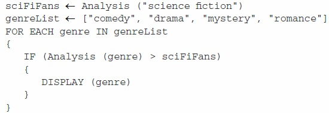

# Question 11
- A spinner is divided into three sections. The sector labeled Red is four times as large as each of the sectors labeled Blue and Yellow, which are of equal size.

The procedure below is intended to simulate the behavior of the spinner.

Which of the following can be used to replace missing code so that the procedure correctly simulates the spinner?

- A. 
- B. 
- C. 
- D.

- i chose A: This option is incorrect. The code segment simulates a spinner in which selecting each of three sections is equally likely.
- right answer was D: This option is correct. The code segment selects "Yellow" one-sixth of the time, "Blue" one-sixth of the time, and "Red" the
remaining two-thirds of the time.

# Question 17
- Which of the following actions could be used to help reduce the digital divide?
- I.   Providing free education and training on how to use computing devices
- II.  Providing free or low-cost computing devices to low-income individuals
- III. Providing networks and infrastructure to people in remote areas
- A. III only
- B. I and II only
- C. II and III only
- D. I, II, and III
- I chose C: This option is incorrect. Free education and training would address digital literacy and would reduce the digital divide.
- right answer was D: This option is correct. Free education and training would address digital literacy. Providing free or low-cost devices would address
a lack of access to devices. Providing networks and infrastructure would address a lack of access to networks.

# Question 22
- A student is creating a procedure to determine whether the weather for a particular month was considered very hot. The procedure takes as input a list containing daily high temperatures for a particular month. The procedure is intended to return true if the daily high temperature was at least 90 degrees for a majority of days in the month and return false otherwise.
- 
- Which of the following can be used to replace missing code so that the procedure works as intended?
- A. Counter < 0.5 x total
- B. Counter > 0.5 x total
- C. total < 0.5 x counter
- D. total > 0.5 x counter
- I chose D: This option is incorrect. This Boolean expression will always evaluate to true because total (the number of temperatures in the
list) will always be greater than 50% of counter (the number of temperatures greater than or equal to 90).
- Right answer was B: This option is correct. This Boolean expression evaluates to true when counter (the number of temperatures greater than or equal to 90) is greater than 50% of total (the number of entries in the list).

# Quetion 24
- Byte pair encoding is a data encoding technique. The encoding algorithm looks for pairs of characters that appear in the string more than once and replaces each instance of that pair with a corresponding character that does not appear in the string. The algorithm saves a list containing the mapping of character pairs to their corresponding replacement characters.
- For example, the string Open quotation, THIS, underscore, IS, underscore, THE, underscore, BEST, underscore, WISH, close quotation can be encoded as Open quotation, percent, hash, underscore, hash, underscore, percent E, underscore, BEST, underscore, W, hash, H, close quotation by replacing all instances of Open quotation, T H, close quotation with Open quotation, percent, close quotationand replacing all instances of Open quotation, I S, close quotation with Open quotation, hash, close quotation.

- Which of the following statements about byte pair encoding is true?

- A. Byte pair encoding is an example of a lossy transformation because it discards some of the data in the original string.
- B. Byte pair encoding is an example of a lossy transformation because some pairs of characters are replaced by a single character.
- C. Byte pair encoding is an example of a lossless transformation because an encoded string can be restored to its original version.
- D. Byte pair encoding is an example of a lossless transformation because it can be used to transmit messages securely.
 
- I chose B: This option is incorrect. While some pairs of characters of the original string are replaced in the encoded string with a single character, this transformation is not lossy because the original version can be restored.
- The right answer was C: This option is correct. The transformation is lossless because an encoded string can be restored to its original version. For example, Open quotation, percent, hash, underscore, hash, underscore, percent E, underscore, BEST, underscore, W, hash, H, close quotation can be restored to Open quotation, THIS, underscore, IS, underscore, THE, underscore, BEST, underscore, WISH, close quotation by replacing all instances of Open quotation, percent, close quotationwith Open quotation, T H, close quotation and by replacing all instances of Open quotation, hash, close quotation with Open quotation, I S, close quotation.

# Question 30
- A video-streaming service maintains a database of information about its customers and the videos they have watched.
- The program below analyzes the data in the database and compares the number of viewers of science fiction videos to the number of viewers of videos of other genres. It uses the procedure Analysis, open parenthesis, category, close parenthesis , which returns the number of unique users who viewed videos of a given category in the past year. The Analysis procedure takes approximately 1 hour to return a result, regardless of the number of videos of the given genre. All other operations happen nearly instantaneously.
- 
- Which of the following best approximates the amount of time it takes the program to execute?

- A. 1 hour
- B. 2 hours
- C.  4 hours
- D. 5 hours
- I chose answer C: This option is incorrect. This approximation assumes that the  Analysis procedure is called only four times.
- the right answer was D: This option is correct. Each call to the Analysis procedure requires one hour of program execution time. The procedure is called once before the loop, and then four times inside the loop (once for each of the four entries in One word, genre List). Therefore, the program will take approximately 5 hours to execute.
