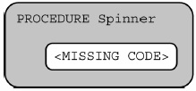

# Question 11
- A spinner is divided into three sections. The sector labeled Red is four times as large as each of the sectors labeled Blue and Yellow, which are of equal size.

The procedure below is intended to simulate the behavior of the spinner.

Which of the following can be used to replace missing code so that the procedure correctly simulates the spinner?

- A. 
- B. 
- C. 
- D.

- i chose A: This option is incorrect. The code segment simulates a spinner in which selecting each of three sections is equally likely.
- right answer was D: This option is correct. The code segment selects "Yellow" one-sixth of the time, "Blue" one-sixth of the time, and "Red" the
remaining two-thirds of the time.

# Question 17
- Which of the following actions could be used to help reduce the digital divide?
- I.   Providing free education and training on how to use computing devices
- II.  Providing free or low-cost computing devices to low-income individuals
- III. Providing networks and infrastructure to people in remote areas
- A. III only
- B. I and II only
- C. II and III only
- D. I, II, and III
- I chose C: This option is incorrect. Free education and training would address digital literacy and would reduce the digital divide.
- right answer was D: This option is correct. Free education and training would address digital literacy. Providing free or low-cost devices would address
a lack of access to devices. Providing networks and infrastructure would address a lack of access to networks.

# Question 22
- A student is creating a procedure to determine whether the weather for a particular month was considered very hot. The procedure takes as input a list containing daily high temperatures for a particular month. The procedure is intended to return true if the daily high temperature was at least 90 degrees for a majority of days in the month and return false otherwise.
- 
- Which of the following can be used to replace missing code so that the procedure works as intended?
- A. Counter < 0.5 x total
- B. Counter > 0.5 x total
- C. total < 0.5 x counter
- D. total > 0.5 x counter
- I chose D: This option is incorrect. This Boolean expression will always evaluate to true because total (the number of temperatures in the
list) will always be greater than 50% of counter (the number of temperatures greater than or equal to 90).
- Right answer was B: This option is correct. This Boolean expression evaluates to true when counter (the number of temperatures greater than or equal to 90) is greater than 50% of total (the number of entries in the list).
