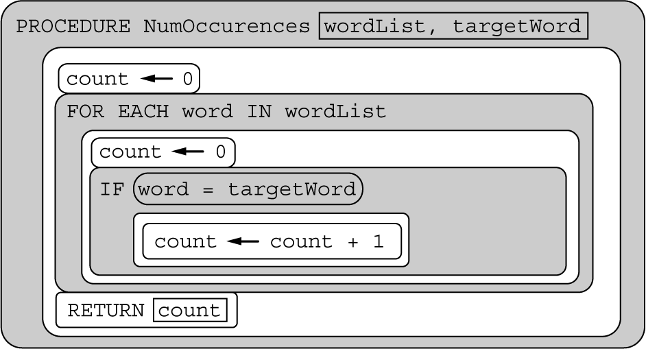

## my journey
- My journey in learning AP Computer Science Principles (AP CSP) has been a fascinating exploration of the interconnected big ideas, particularly Big Ideas 4 and 5, which delve into the global impacts of computing and the algorithms and programming behind it. As I delved into Big Idea 4, the societal impacts of computing, I gained a profound understanding of the ethical considerations and the ways in which technology shapes the world. Learning about the implications of computing on privacy, security, and intellectual property has been eye-opening, making me more conscious of the responsibilities that come with technological advancements.

- Transitioning to Big Idea 5, which focuses on the development of algorithms and the process of programming, I found myself immersed in the intricacies of problem-solving and the art of writing efficient code. From designing algorithms to translating them into code snippets, this journey has equipped me with the skills to tackle real-world challenges through computational thinking. Debugging, troubleshooting, and optimizing algorithms have become second nature as I navigate the complexities of programming.

- Throughout this educational adventure, I've not only learned to appreciate the power of computing but also developed a keen awareness of its ethical dimensions. Understanding the global impact of technology and the nuts and bolts of programming has not only deepened my knowledge but has also ignited a passion for contributing responsibly to the ever-evolving world of computer science. This journey in AP CSP has been instrumental in shaping my perspective, honing my problem-solving abilities, and preparing me for the dynamic landscape of the digital age.

## what i learned
- Embarking on the exploration of Big Ideas 4 and 5 in AP Computer Science Principles has been an enlightening journey, unveiling the profound societal impacts and intricate programming aspects of the world of computing. In Big Idea 4, delving into the global implications of computing, I have gained a comprehensive understanding of the ethical considerations and societal ramifications inherent in the development and implementation of technology. Concepts such as privacy, security, and intellectual property have become not just theoretical notions, but practical considerations that underscore the responsibility that comes with technological innovation.

- Transitioning to Big Idea 5, which revolves around the creation and analysis of algorithms, my learning experience delved into the essence of problem-solving and the art of programming. From crafting algorithms to translating them into functional code, I have acquired the skills necessary to approach real-world challenges with a computational mindset. Debugging, optimizing, and refining algorithms have become integral aspects of my programming proficiency, contributing to a holistic understanding of the coding process.

- This journey through Big Ideas 4 and 5 has not only expanded my knowledge but has also fostered a deep appreciation for the multifaceted nature of computer science. It has equipped me with a well-rounded skill set, blending ethical considerations with the technical prowess needed to navigate the dynamic landscape of technology. As I continue to unravel the complexities of AP Computer Science Principles, I am gaining valuable insights that extend beyond the classroom, preparing me to contribute meaningfully to the ever-evolving world of computer science.

## what have i disovered 
- Exploring the realms of Big Ideas 4 and 5 in AP Computer Science Principles has been akin to uncovering hidden treasures in the world of computing. Big Idea 4, which delves into the societal impacts of computing, has been a journey into the ethical dimensions that underpin technological advancements. Discovering the intricacies of privacy, security, and the global consequences of technology has expanded my awareness, revealing the profound responsibilities that come with wielding computational power. The realization that the code we write can have far-reaching implications has been eye-opening, emphasizing the need for conscientious and thoughtful programming.

- Transitioning to Big Idea 5, the discovery of algorithms and programming principles has been like unraveling the secrets of a well-guarded puzzle. From understanding the fundamental concepts of algorithmic design to implementing efficient solutions in code, each discovery has been a step closer to mastery. The joy of debugging, the thrill of optimization, and the art of crafting algorithms have become not just academic pursuits but practical tools for tackling real-world problems. Every discovery in the realm of programming has contributed to a deeper understanding of the language of computers and the limitless possibilities it holds.

- In essence, my discoveries in AP Computer Science Principles, particularly in Big Ideas 4 and 5, have been transformative. They have shaped my perspective on the ethical considerations inherent in computing and empowered me with the skills to navigate the intricate landscape of programming. The knowledge gained is not merely academic; it forms the foundation for a future where I can contribute meaningfully to the innovative and ever-evolving field of computer science.

## mc review

### question 11
A color in a computing application is represented by an RGB triplet that describes the amount of red, green, and blue, respectively, used to create the desired color. A selection of colors and their corresponding RGB triplets are shown in the following table. Each value is represented in decimal (base 10).

| color name | RGB Triplet |
|------------|-------------|
| Indigo   | (75,   0, 130) | 
| ivory   | (255, 255, 240) | 
| light pink | (255, 182, 193) |
| light yellow | ​(255, 255, 224) |
| magenta | (255, 0, 255) |
| neutral gray | (127, 127, 112) |
| pale yellow | (255, 255, 160) |
| vivid yellow | (255, 255,  14) |

According to information in the table, what color is represented by the binary RGB triplet (11111111, 11111111, 11110000)?
a. ivory
b. light yellow
c. neutral gray
d. vivid yellow

- i chose b, which was incorect because the binary RGB triplet for light yellow is (11111111, 11111111, 11100000).
- the right answer was a because the binary number 11111111 is equal to 2^7+2^6+2^5+2^4+2^3+2^2+2^1+2^0, or 255. The binary number 11110000 is equal to 2^7+2^6+2^5+2^4, or 240. Therefore, the given binary triplet represents the color ivory.

### question 23 
A flowchart is a way to visually represent an algorithm. The flowchart below is used by an application to set the Boolean variable available to true under certain conditions. The flowchart uses the Boolean variable weekday and the integer variable miles.

| block | Explanation |
| ----- | ----------- |
| Oval | The start or end of the algorithm |
| Diamond | A conditional or decision step, where execution proceeds to the side labeled true if the condition is true and to the side labeled false otherwise |
| Rectangle	| One or more processing steps, such as a statement that assigns a value to a variable |

Which of the following statements is equivalent to the algorithm in the flowchart?
a. 
b. 
c. 
d. 

- i chose b, but it was incorrect because the expression would be equivalent to an algorithm that sets available to true whenever weekday is true and miles is at least 20. The algorithm in the flowchart requires both conditions to be true in order to set available to true.
- the correct answer would be d because the flowchart sets available to true whenever weekday is true and miles is less than 20, and sets available to false otherwise. This code statement provides the same functionality.

### question 60
Consider two lists of numbers called list1 and list2. A programmer wants to determine how many different values appear in both lists. For example, if list1 contains [10, 10, 20, 30, 40, 50, 60] and list2 contains [20, 20, 40, 60, 80], then there are three different values that appear in both lists (20, 40, and 60).

The programmer has the following procedures available.

| Procedure Call | Explanation |
| -------------- | ----------- |
| Combine (myList1, myList2) | This procedure creates a new list containing the elements from myList1 ​followed by the entries from myList2. The resulting list is returned. For example, if myList1 contains [2, 4, 6] and myList2 contains [1, 5], the procedure will return the list [2, 4, 6, 1, 5]. |
| RemoveAllDups (myList) | This procedure creates a new list containing the elements of myList with any duplicate values removed. The resulting list is returned. For example, if myList contains [3, 2, 4, 2, 2, 5, 6, 4], the procedure will return the list [3, 2, 4, 5, 6]. | 

Which of the following can be used to assign the intended value to count?

a. bothList <- Combine (list1, list2)
   uniqueList <- RemoveAllDups (bothList)
   count <- LENGTH (bothList) - LENGTH (uniqueList)
b. newList1 <- RemoveAllDups (list1)
   newList2 <- RemoveAllDups (list2)
   bothList <- Combine (newList1, newList2)
   count <- LENGTH (list1) + LENGTH (list2) - LENGTH (bothList)
c. newList1 <- RemoveAllDups (list1)
   newList2 <- RemoveAllDups (list2)
   bothList <- Combine (newList1, newList2)
   count <- LENGTH (newList1) + LENGTH (newList2) - LENGTH (bothList)
d. newList1 <- RemoveAllDups (list1)
   newList2 <- RemoveAllDups (list2)
   bothList <- Combine (newList1, newList2)
   uniqueList <- RemoveAllDups (bothList)
   count <- LENGTH (bothList) - LENGTH (uniqueList)

- i chose c, which was incorrect because, for example, assume that list1 contains [10, 10, 20, 30, 40, 50, 60] and list2 contains [20, 20, 40, 60, 80]. The first line of code creates newList1, which contains [10, 20, 30, 40, 50, 60]. The second line of code creates newList2, which contains [20, 40, 60, 80]. The third line of code creates bothList, which contains [10, 20, 30, 40, 50, 60, 20, 40, 60, 80]. The fourth line of code assigns to count the length of newList1 (6) plus the length of newList2 (4) minus the length of bothList (10), producing the incorrect result 0.
- the correct answer was d because this code segment creates newList1, containing the unique elements from list1, and newList2, containing the unique elements from list2. These two lists are combined to form bothList. Any elements that appear in both lists are removed from bothList to form uniqueList. The correct count is the difference between the lengths of bothList and uniqueList. For example, assume that list1 contains [10, 10, 20, 30, 40, 50, 60] and list2 contains [20, 20, 40, 60, 80]. The first line of code creates newList1, which contains [10, 20, 30, 40, 50, 60]. The second line of code creates newList2, which contains [20, 40, 60, 80]. The third line of code creates bothList, which contains [10, 20, 30, 40, 50, 60, 20, 40, 60, 80]. The fourth line of code creates uniqueList, which contains [10, 20, 30, 40, 50, 60, 80]. Since bothList contains 10 elements and uniqueList contains 7 elements, the correct result 3 is assigned to count.

### question 67

The procedure NumOccurrences is intended to count and return the number of times targetWord appears in the list wordList. The procedure does not work as intended.

For which of the following code segments will the call to NumOccurrences NOT return the intended value?

Select two answers.

a. 
b. 
c. 
d. 

- i chose c and d. c was wrong because the code segment, count is increased to 1 when "oak" is encountered as the last element of the list. The loop then terminates and the procedure returns the intended result 1. d was wrong because the code segment, count is initialized to 0. Since "spruce" does not appear in the list, the procedure returns the intended result 0.
- the correct answers were a and b. a was right because the code segment, count is increased to 1 the first time "birch" is encountered in the list. However, count is reset to 0 when the code segment moves to the next list element. The last time "birch" is encountered in the list, count is again increased to 1, causing the procedure to return 1 instead of the intended result 2. b was right because the code segment, count is increased to 1 the first time "maple" is encountered in the list. However, count is reset to 0 when the code segment moves to the next list element. This causes the procedure to return 0 instead of the intended result 1.