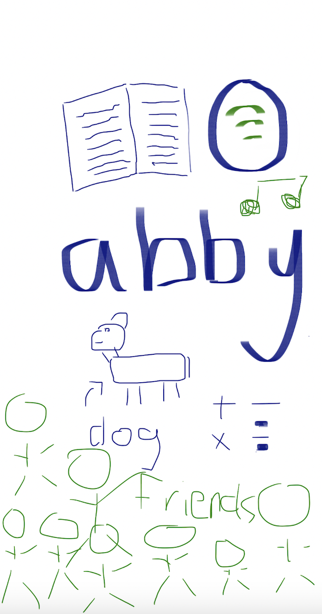
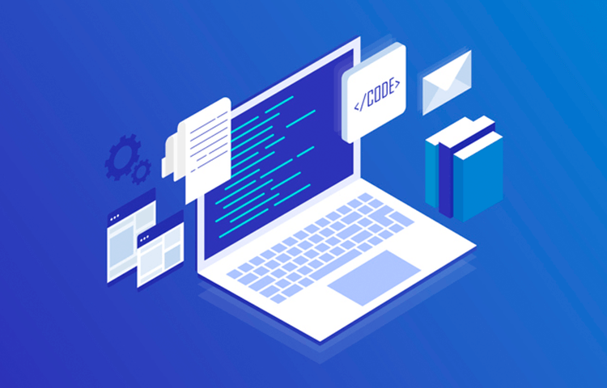

---
layout: default
title: Abby's Student Blog
--- 

## <code style="color: #ADD8E6;"> Abbys Notebook</code>
Welcome to my page.

## <code style="color: #ADD8E6;"> All About Me
My name is Abby Albert and I am in 10th grade. My favorite things to do are read, listen to music, sleep, and hang out with my friends. I have 4 people in my family, my mom, dad, sister, and I. My dog's name is Walter and he is a 1.5 year old Golden Retriever. My favorite subects are math and science. 

## <code style="color: #ADD8E6;"> Tools and Issues
When downloading homebrew I had some issues, so exited out of the terminal and reloaded the homebrew webpage. From there I copied the homebrew link again and put it into a new terminal and it worked. WHen trying to type  codes into the terminal, I would sometimes get an error message. But when looking back on what I put into the terminal, I found that I misspelled some things. When working on the blog I had some trouble commiting and syncing the changes to the page. I asked for help and realized that we needed to type something into the space above the commit button and then hit the check mark. I collaborated with my partner very well, and we were able fix all the problems that came up. 

## Overview of Hacks, Study and Tangibles
- Plans, Lists, [Scrum Boards](https://clickup.com/blog/scrum-board/) help you to track key events, show progress and record time.  Effort is a big part of your class grade.  Show plans and time spent!
- [Hacks(Todo)](https://levelup.gitconnected.com/six-ultimate-daily-hacks-for-every-programmer-60f5f10feae) enable you to stay in focus with key requirements of the class.  Each Hack will produce Tangibles.
- Tangibles or [Tangible Artifacts](https://en.wikipedia.org/wiki/Artifact_(software_development)) are things you accumulate as a learner and coder. 

